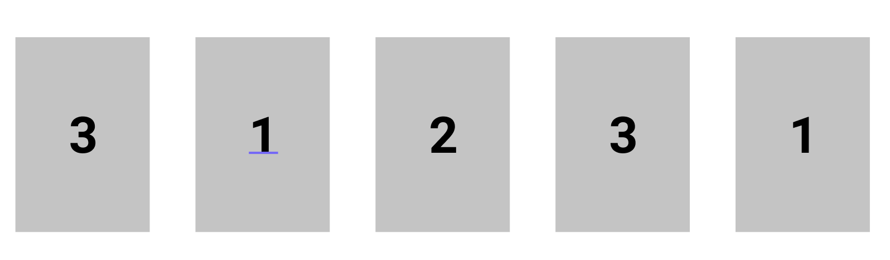

# [자기 소개 및 프로젝트 소개를 위한 페이지](https://since-1994.github.io/portfolio/)

## 전체적인 구성 방법

좀 더 효율적으로 진행해보기 위해 ES6 모듈 시스템으로 기능별로 클래스 기반의 모듈로 나누어보았습니다.
`index.html`파일에는 root라는 id를 갖는 div element만 두고 component를 쌓아가는 방법이었습니다. 제가 느낀 장점은 아래와 같습니다.

- 코드 수정이 용이하다.

  역할별로 파일이 나뉘다보니 어떤 부분에 대한 코드를 고치자 했을 때 고칠 부분을 찾고 수정하는 것이 쉬워졌습니다.

- 변수 사용이 자유롭다.

  한 파일에서 변수를 작성하다보면 나름의 규칙을 갖고 작성하여도 의도치 않은 중복으로 에러 발생 원인을 찾기 어려운 경우가 종종 있었습니다. 하지만 모듈로 관리하니 변수 사용에서 자유로운 점이 좋았습니다.

또한 한 페이지에 한내용을 담음으로써 사용자의 집중도를 높이고 싶어 페이지 별로 100vh의 높이를 주어 구성해보았습니다. 하지만 이 부분은 실제 적용해보니 오히려 단점이 많았습니다.

- 한 페이지를 넘어가는 내용이 필요할 경우 불가피하게 두 페이지로 나뉘어 오히려 집중력을 떨어트릴 수 있다.
- 반응형 페이지를 구성하기 위한 관리가 쉽지 않다.

  viewport의 너비와 관계없이 한 페이지에 들어가는 내용을 똑같이 하려다보니 반응형 페이지를 구성하는 것이 쉽지 않았습니다.

## 구현된 주요 기능

### 페이지 이동에 따른 indicator

사이트는 크게 세가지의 주제를 가진 페이지로 나뉩니다. 각각 Home, About me, Projects 입니다. 사용자가 스크롤을 하며 페이지를 이동할때 현재 보고 있는 페이지가 어떤 의미를 가진 페이지인지 알려주고 싶었습니다. 그래서 nav-bar부분을 두 가지 역할로 사용하기로 했고 아래와 같이 구현하였습니다.

1. nav-bar에 위치한 버튼을 누르면 각 주제로 이동

   전체적인 구성 방법에서 언급한 것 처럼 주제에 맞게 100vh의 높이를 주어 페이지를 나누었기 때문에 이 부분은 window.scroll을 사용하여 쉽게 구현할 수 있었습니다.

   ```javascript
   const items = document.querySelectorAll(".nav__item--left");
   items.forEach((i) => {
     i.addEventListener("click", () => {
       const id = i.dataset.id;
       window.scroll({
         top: window.innerHeight * id,
         left: 0,
         behavior: "smooth",
       });
     });
   });
   ```

   window.scroll에 top, left, behavior 등을 포함한 객체를 전달하면 이에 맞게 스크롤을 이동시켜주는데요. 각 버튼을 눌렀을때의 이동하는 양이 달라야 하므로 각각의 버튼마다 id를 주고(0, 1, 2) id에 window.innerHeight을 곱해서 이동시켜주었습니다. behavior의 경우에 smooth로 해주면 스크롤 이동이 애니메이션처럼 부드럽게 동작합니다.

2. 현재 보고있는 페이지에 맞게 nav-bar에 표시

   사용자가 직접 스크롤해서 이동했을때 현재 위치에 대한 indicator로 nav-bar를 사용해보자고 생각했습니다. 이렇게 생각한 이유는 nav-bar를 fixed로 고정시켰기 때문에 어떤 페이지에서도 확인할 수 있기 때문입니다. indicator의 역할을 수행하기 위해 밑줄을 그어주는 방식을 사용했습니다.

   

   이걸 구현하기 위해서는 IntersectoinObsever를 사용했습니다. window에 scroll event listener를 달아주는 것보다 굉장히 직관적이고 빨랐습니다. 각 페이지가 isIntersecting 됐을 때 해당 페이지에 맞게 밑줄을 그어줍니다. 구현할 때 발생했던 문제로 한 페이지에서 다른 페이지로 왔다 갔다 할때 indicator가 제대로 동작하지 않는 경우가 있었는데요. 이거는 threshold가 너무 작은 경우에 발생했습니다. 예를 들어 threshold가 0.1 이라고 하면 두 페이지 모두 0.1이 넘어버린 경우에 제대로 동작하지 않는 것입니다. 이 문제는 threshold를 적절히 0.4로 키워주어 해결하였습니다.

   다른 해결 방법으로 관찰 대상이 벗어나는 경우도 처리해주면 더욱 확실히 할 수 있겠습니다.

   ```javascript
   this.io = new IntersectionObserver(
     (entries, observer) => {
       entries.forEach((entry) => {
         if (entry.isIntersecting) {
           this.nav.setState({ selected: entry.target.dataset.id });
         }
       });
     },
     {
       threshold: 0.4,
     }
   );
   ```

### 다크 모드

이번 프로젝트를 통해서 다크모드를 처음 구현해봤는데요. 다크 모드를 구현하기에 앞서 고려할 점은 사용자의 os에 저장된 다크모드에 관한 설정을 가져오는 것이 좋다는 것입니다. 사용자가 기존에 설정해놓은 모드를 통해 사용자가 따로 설정하지 않더라도 선호하는 모드에 맞게 스타일을 제공할 수 있습니다. 설정을 가져오기 위해서는 아래 코드를 사용했습니다.

`window.matchMedia('(prefers-color-scheme: dark)').matches`

다크 모드가 설정됐는지 여부에 따라 boolean값을 반환해줍니다. 전달 받은 boolean값에 따라 다크 모드를 적용하기 위해서는 스타일이 적용되는 상위 element인 body에 dataset값으로 mode라는 property에 값을 담아 전달하였습니다.

- 다크모드인 경우

`document.body.dataset.mode = 'dark';`

- 라이트모드인 경우

`document.body.dataset.mode = 'light';`

body에 mode에 따라 아래와 같이 CSS를 이용하여 스타일링 해주었습니다.

```
body[data-mode="dark"]{
background-color: black;
color: white;
}
```

세부적인 스타일링은 아래와 같이 해주었습니다.

```
body[data-mode="dark"] element{
/*원하는 스타일링*/
}
```

### project page에 corousel 구현

캐러셀을 구현해야겠다고 생각한 이유는 한 주제에 한 페이지를 할당했기 떄문입니다.

About me 페이지는 텍스트가 너무 길어지면 지루할 것 같아 좀 더 읽기 쉽게 하기 위해 두 페이지로 늘려주긴했지만 다른 페이지의 경우 한 페이지 씩 늘리다보면 원래 의도가 사라질것이라고 생각하였고 특히나 프로젝트의 경우 미래에는 다른 프로젝트도 추가될 것을 고려하다보니 캐러셀을 구현해야겠다고 생각하게 되었습니다.

제가 사용한 방법은 크게는 세 개의 element가 사용됩니다. 가장 안쪽에는 보여주고자 하는 여러 element가 들어가 있고 이 element들을 감싸는 slide라 불리는 element가 있고 마지막으로 slide를 감싸는 slide-container라 불리는 element가 하나 있습니다. slide를 각 아이템의 너비만큼 움직이면 캐러셀의 효과를 얻을 수 있습니다. 추가로 prev-btn과 next-btn을 만들어주어 각 버튼을 통해 아이템을 이동하며 볼 수 있도록 하였습니다.

```
  |--slide-container
    |--slide
      |--item1
      |--item2
      |--item3
```

slide-container에는 우리가 실제로 보고자하는 너비와 높이를 설정해줍니다. 또한 현재 보고자하는 item만 보기 위해 `overflow-x: hidden`이나 `overflow: hidden`을 추가해줍니다.

```
.slide-container{
  height: 100%;
  width: 80%;
  overflow-x: hidden;
}
```

slide에는 item을 수평으로 정렬하기 위해 `display: flex`정도만 추가해주면 다른 것은 원하는 목적에 맞게 해주면 됩니다.

```
.slide{
    display: flex;
    width: 100%;
}
```

각 item은 slide의 너비와 동일하게 해주는 것이 좋습니다. 또한 각 item이 부모 너비에 맞게 줄어드는 것을 막기 위해 `flex-shrink`는 0으로 해주었습니다.

```
.slide__item{
    width: 100%;
    flex-shrink: 0;
}
```

여기까지 해주고 이제 JavaScript로 처리해줄 부분은 slide를 이동시키는 것입니다.

```javascript
//size는 각 item의 너비를 의미합니다.
//javascript에서 처리하는 이유는 너비가 절대적인 값이 아니라
//사용자의 viewport에 따라 변하기 때문에 clientWidth를 이용하였습니다.
const size = items[0].clientWidth;

//counter는 현재 보여질 item의 번호를 의미합니다.
this.counter += 1;

const slide = document.querySelector(".slide");

//transition을 이처럼 매번 설정해주는 이유는 아래에서 나옵니다.
slide.style.transition = "transform .4s ease-in-out";
slide.style.transform = `translateX(-${size * this.counter}px)`;
```

위에보면 근데 조금 이상한 점이 매번 transition에 대한 설정을 해주는 점입니다. transition같은 것은 css에서 명시해주는 것이 더 나을 것 같은데요. 이렇게 한 이유는 마지막 아이템일때 next-btn이 눌리면 첫번째 아이템으로 돌아가고 첫번째 아이템일때 prev-btn이 눌리면 마지막 아이템으로 돌아가기 위한 것을 구현하기 위함입니다. 이것을 구현하기 위해 약간의 트릭을 사용한 것입니다.

바로 첫번째 아이템과 마지막 아이템이 아래와 같이 실제로는 두개가 존재합니다. 1번에서 3번으로 갔을때 3번으로 간 후에 뒤에서는 사용자가 모르게 오른쪽의 3번으로 transition없이 이동합니다. 3번에서 1번으로 갈때도 마찬가지로 1번으로 이동한 다음에 transition없이 왼쪽 1번으로 이동합니다. 이렇게 하면 사용자 입장에서는 계속 반복되는 캐러셀을 사용할 수 있습니다.

